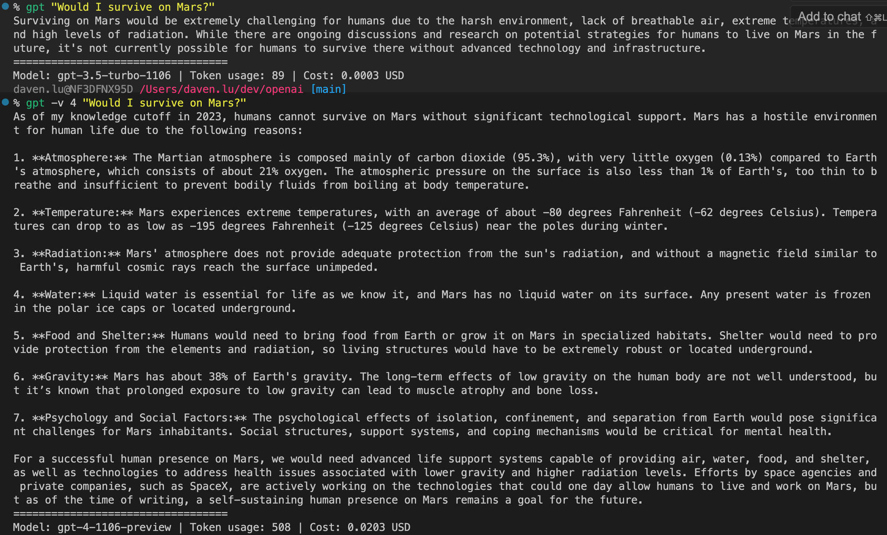

# GPT CLI

This command-line interface (CLI) tool enables the use of OpenAI's GPT models directly from your terminal. It is designed to be cost-effective by utilizing the latest "turbo" versions of the GPT models, including GPT 3.5 turbo and GPT 4 turbo, as of December 2023.

Edit Dec 2023: I made a terrible mistake; the original way to invoke this cli tool was `gpt <prompt>`, but it never occured to me that `gpt` is an existing tool--[GUID partition table maintenance utulity](https://www.unix.com/man-page/OSX/8/gpt/). Silly me.

## Table of Contents

-   [Usage](#usage)
-   [Prerequisites](#prerequisites)
-   [Configuration](#configuration)
-   [Installation](#installation)

## Usage

```bash
% prompt "Hello, GPT3.5-turbo!"
Hello! How can I assist you today?
==================================
Model: gpt-3.5-turbo-1106 | Token usage: 27 | Cost: 0.0001 USD

% prompt -v 4 "Hello, GPT4-turbo!"
Hello! How can I assist you today?
==================================
Model: gpt-4-1106-preview | Token usage: 27 | Cost: 0.0011 USD
```

### Images speak louder than words.



## Prerequisites

-   Python 3.11 or higher (needed to create a virtual environment)
-   Python Pip

## Configuration

Follow these steps to set up the GPT CLI on your system:

### Set up the install script.

-   In `install_scripts/install.sh`, change the below parameters to match your system. By default `SOURCE_CONFIG_FILE_PATH` is `~`, and `CONFIG_FILENAME` is `.zshrc`.

```bash
SOURCE_CONFIG_FILE_PATH="~"
CONFIG_FILENAME=".zshrc"
```

-   If you are on Windows, you may have `python` mapped to `python3`, in which case you might have to change this line

```
    python3 -m venv $VENV_DIR/venv
```

to this

```
    python -m venv $VENV_DIR/venv
```

After configuring `install.sh`, save the file and proceed.

## Installation

```bash
cd install_scripts
sh install.sh
```

## Changing the invocation alias

To change the alias, go to `invoke_gpt.sh` and locate the function:

```bash
prompt() {
    source $GPT_APP_PATH/venv/bin/activate
    python3 $GPT_APP_PATH/ask.py "$@"
    deactivate
}
```

Change this function name (`prompt`) to whatever you'd like. Don't forget to re-`source` your `.zshrc` or `.bashrc`.
